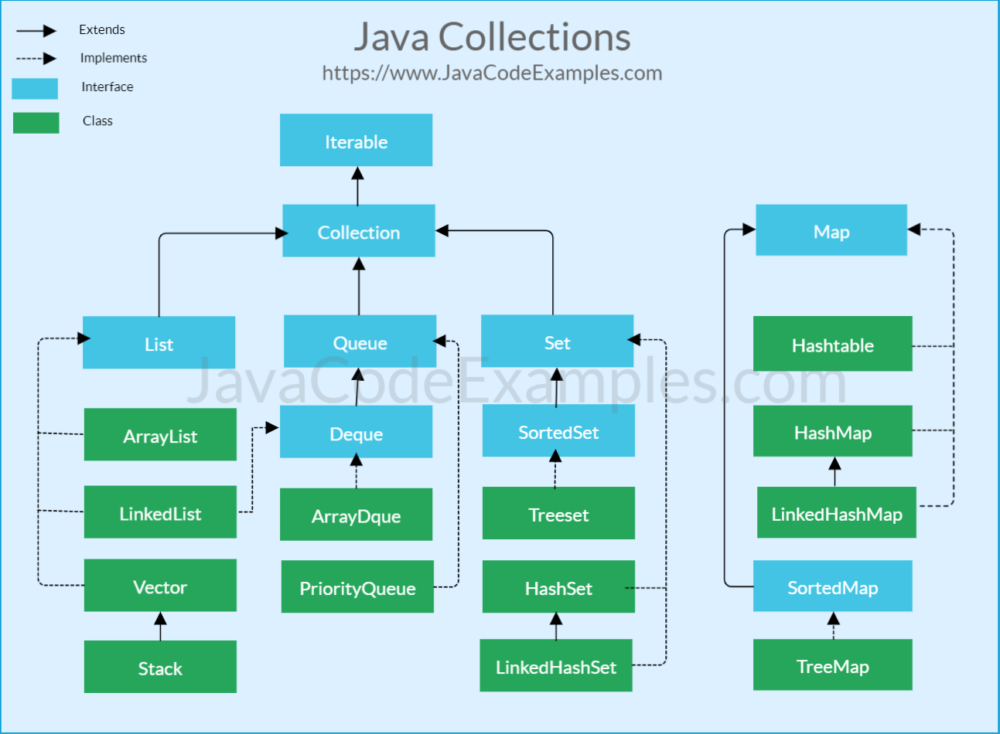

## Java Collections

#### Repositório com o intuito de conter informações "básicas" sobre pontos importantes

<i>Uma Collection representa um grupo de objetos, objetos em uma Collection é chamado de elementos. Algumas Collections permitem elementos duplicados, outras não. Algumas são ordenadas e outras desordenadas.</i>

<i>Possui implementações para manipular esses elementos</i>

### List\<E\>

- Também chamada de coleção ordenada
- Possui sequência nos seus elementos
  - A sequência em que se insere os elementos é como fica dentro da ```List```
- Existe um controle preciso em qual lugar da lista cada elemento é inserido
- Elementos podem ser acessados por seus índices na lista
- ```ArrayList``` e ```LinkedList``` são os mais utilizados
- Lento para manipular os elementos, pois, precisa percorrer toda a lista até encontrar o alvo

```
  String aula1 = "Conhecendo mais de listas";
  String aula2 = "Modelando a classe aula";
  String aula3 = "Trabalhando com Cursos e Sets";
  
  List<String> aulas = new ArrayList<>();
  
  aulas.add(aula2);
  aulas.add(aula1);
  aulas.add(aula3);
  
  System.out.println(aulas.toString());
  
  aulas.remove(0);
  
  System.out.println(aulas);
  
  aulas.forEach(aula -> {
      System.out.println("Aula " + (aulas.indexOf(aula) + 1) + ": " + aula);
  });
  
  System.out.println("A primeira aula é: " + aulas.get(0));
  
  for (int i = 0; i < aulas.size(); ++i) {
      System.out.println("Aula " + (i + 1) + ": " + aulas.get(i));
  }
  
  aulas.clear();
  
  aulas.add(aula2);
  aulas.add(aula1);
  aulas.add(aula3);
  
  System.out.println("Desordenado: " + aulas);
  Collections.sort(aulas);
  System.out.println("Ordenado: " + aulas);
```

### Set\<E\>

- A grande vantagem é velocidade
  - Pesquisar por um elemento é mais rápido que em uma ```List```
  - Remover, adicionar ou verificar se existe no conjunto por exemplo
  - ```.contains()``` ```.remove()``` ```.add()```
- Garante elementos únicos (não será adicionado dois objetos iguais)
  - Por não aceitar elementos repetidos, o método ```.add()``` retorna um ```boolean``` para dizer se o elemento foi inserido ou não
- Não tem garantia da ordem dos elementos
  - A ordem da inserção dos elementos não é a mesma de dentro do conjunto
  - Por não possuir uma ordem, não possui método ```.get(index)```
- Para acessar os elementos é preciso utilizar ```alunos.forEach(aluno -> { });``` ou ```for (String aluno : alunos) { }``` ou dependendo do caso até ```alunos.forEach(System.out::println)```
- ```HashSet``` é o mais utilizado
- <i><u>Em caso de sobrescrever o método</u> ```.equals()```<u>, o método</u> ```.hashCode()``` <u>também deve ser sobrescrito</u></i>


```
  Set<String> alunos = new HashSet<>();
  
  alunos.add("Rodrigo Turini");
  alunos.add("Nico Steppat");
  
  System.out.println(alunos);
  
  alunos.add("Alberto Souza");
  alunos.add("Sergio Lopes");
  alunos.add("Renan Saggio");
  alunos.add("Mauricio Aniche");
  
  alunos.forEach(aluno -> {
      System.out.println(aluno);
  });
  
  System.out.println();
  alunos.remove("Sergio Lopes");
  
  alunos.forEach(aluno -> {
      System.out.println(aluno);
  });
  
  alunos.forEach(System.out::println);
```

### Map\<K, V\>

- Mapeia uma chave para um valor
- Um ```Map``` não pode conter elementos iguais
- Utiliza tabela de espalhamento
- Muito rápido
- ```HashMap``` é o mais utilizado
- ```LinkedHashMap``` armazena a ordem de inserção dos elementos
- A chave deve ser única

```
  Curso javaColecoes = new Curso("Dominando as coleções do Java", "Paulo Silveira");
  
  javaColecoes.adiciona(new Aula("Trabalhando com ArrayList", 21));
  javaColecoes.adiciona(new Aula("Revistando as ArrayLists", 20));
  javaColecoes.adiciona(new Aula("Listas de objetos", 24));
  
  Aluno a3 = new Aluno("Mauricio Anchie", 17645);
  Aluno a1 = new Aluno("Rodrigo Turini", 34672);
  Aluno a2 = new Aluno("Guilherme Silveira", 5617);
  Aluno a4 = new Aluno("João Neiva", 6687);
  Aluno a5 = new Aluno("Guilherme Silveira", 5617);
  
  javaColecoes.matricula(a1);
  javaColecoes.matricula(a2);
  javaColecoes.matricula(a3);
  
  System.out.println("Quem é o aluno com matrícula 5617?");
  javaColecoes.buscaMatriculado(5617);
```

---


